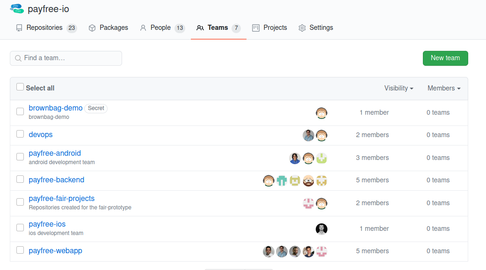
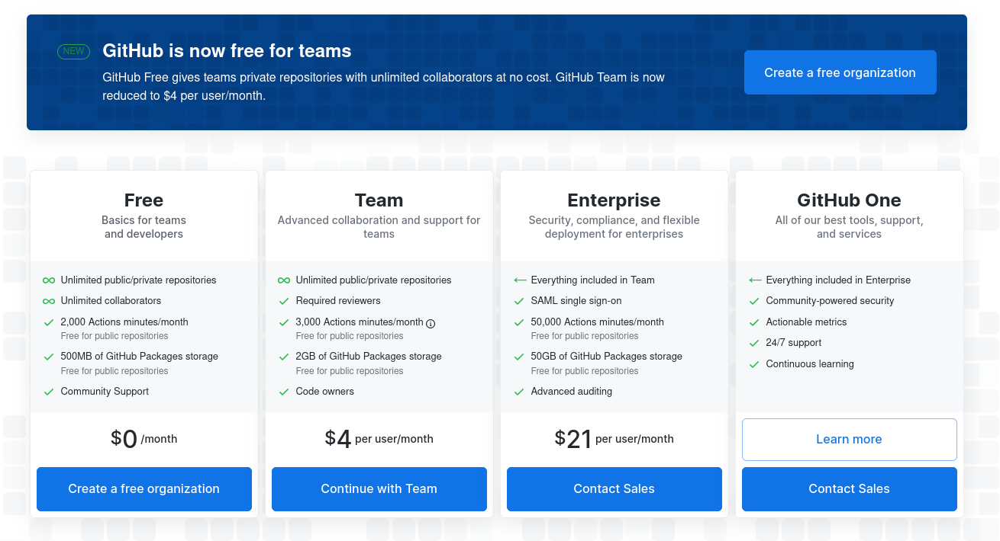
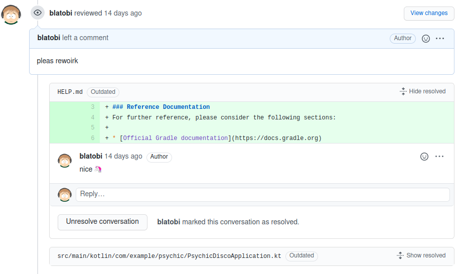
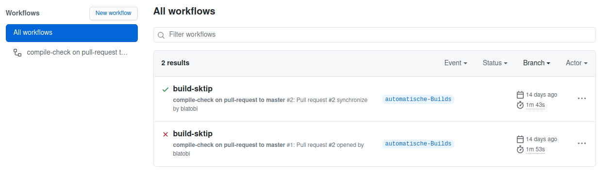
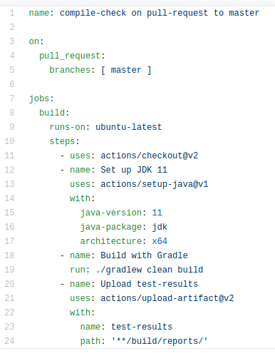
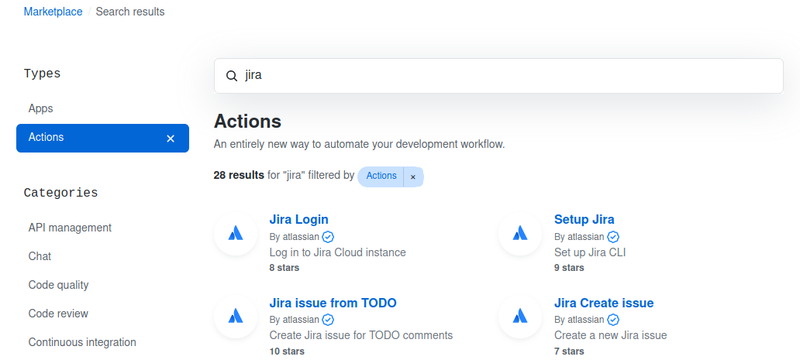
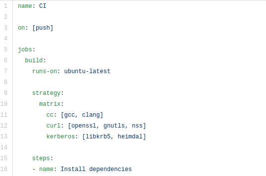
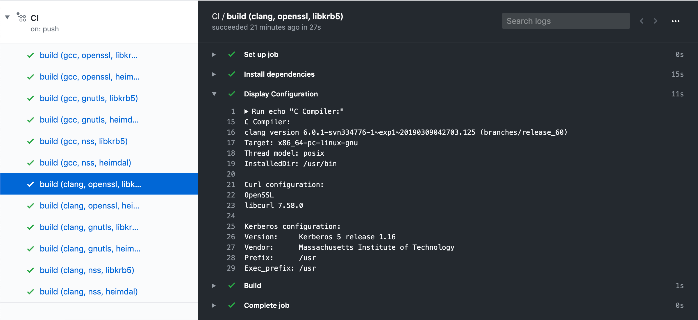

<!--s-->
## Was bisher geschah
* Management von Projekten und Teams
* beispielhafter Entwicklungsprozess inkl. Code-Review
* automatische Builds
  * Workflows
  * Actions
  * Build-Matrix

<!--s-->
## Management von Projekten und Teams

* payfree.io-Organisation

<!--s-->
## Preismodell

<!--s-->
## Entwicklungsprozess & Code-Review

* repository psychic-disco
* Restriktionen auf Branches
* Code-Review

## automatische Builds

* Workflows

## automatische Builds

* Workflows

## automatische Builds

* Workflows
* Actions

## automatische Builds

* Workflows
* Actions
* Matrix-Builds

## automatische Builds

* Workflows
* Actions
* Matrix-Builds

